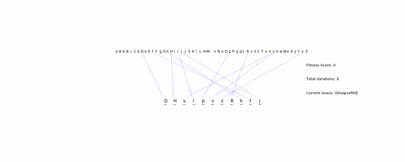
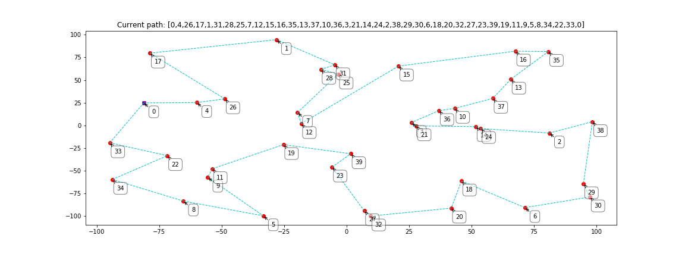
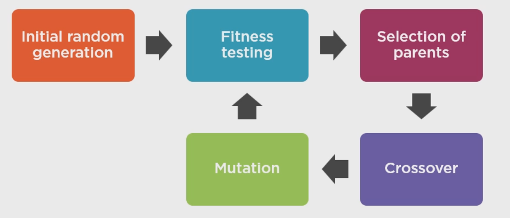
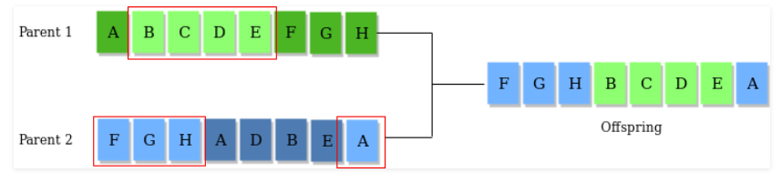
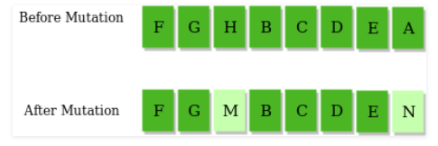

# Genetic Algorithms in Python
>[Project Proposal](https://drive.google.com/open?id=1_J8gyWmiVxVyxVxKWK-81Zo53TYyDTD6)

>[Project Presentation](https://drive.google.com/open?id=1ze0ppJCZHvvU6jA7TjZ0iNwRWxT3S5nMaDA-EgogiV4)

### String Matching Solution

**FINAL SNAPSHOT**

### Traveling Salesman Solution

**FINAL SNAPSHOT**

## Introduction to Genetic Algorithms
### Evolutionary Algorithms
A type of machine learning that uses principles from nature to evolve a solution. Optimization is performed using evolutionary algorithms (EAs). The difference between traditional algorithms and EAs is that EAs are not static but dynamic as they can evolve over time.

The genetic algorithm is a random-based classical evolutionary algorithm. By random here we mean that in order to find a solution using the GA, random changes applied to the current solutions to generate new ones. Note that GA may be called Simple GA (SGA) due to its simplicity compared to other EAs. GA is based on Darwin’s theory of evolution. It is a slow gradual process that works by making changes to the making slight and slow changes. Also, GA makes slight changes to its solutions slowly until getting the best solution.

To summarize, the first step is to **generate a random population** of candidate solutions with each solution being a collection of data. The specifics of the representation of that data depends on the problem. After **defining an initial population** of randomly generated candidate solutions, the next step is to **evaluate the fitness** for each candidate in our population. That evaluation is specific to the particular problem we're trying to solve, but it always involves using the candidate data, and it always results in a numeric fitness score for each candidate. Based on those fitness scores we **select parent solutions** with generally higher fitness values, and then **crossover genetic information** from each to form child solutions. Those child solutions may undergo a **mutation**, and then the children form the next generation of the population. This process is repeated until after a certain number of generations that candidate with the best fitness is chosen as the ultimate solution to the problem.

#### Genetic Scheme

#### Crossover Example

#### Mutation Example

One of the important ideas in evolutionary computing is the **solutions space**. The solution space is a set of all possible solutions to a given problem. **NP-hard** or **non-deterministic polynomial-time hardness** problems refers to a class of problems that are difficult to find a solution for. Non-deterministic means that for any given attempt to solve a problem, we may end up with a different solution due to a strong element of randomness in evolutionary computing. The polynomial-time part of it refers to measuring how long it takes to find a solution. **Combinatorial optimization** is a technique of finding an optimal combination of a given set of objects where an exhaustive search is not feasible. 

### Applications 
The genetic algorithm are effective in finding the optimal solutions, for example, finding an optimal subset of items to fit within a constrained area, optimally packing containers, resources allocation, shipping or dispatching, optimal ordering of data (where the number of possible permutations makes a brute-force approach impossible), optimal time manufacturing or scheduling. The genetic programming helps us in finding an equation to fit a set of data, to control a process, to control the movement of an object in space, to select stocks or investments, to generate keys for different types of cryptography, to create a strategy for picking a good starting hand for Texas Hold'em Poker, etc. 
